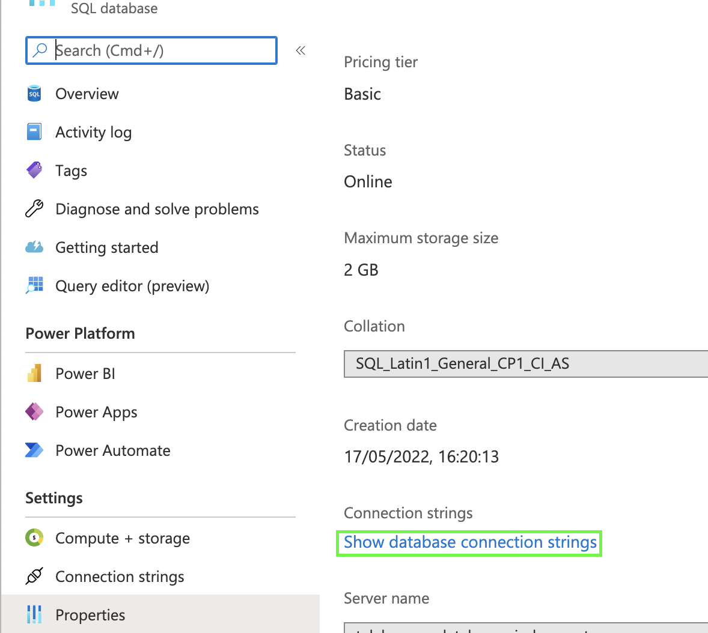
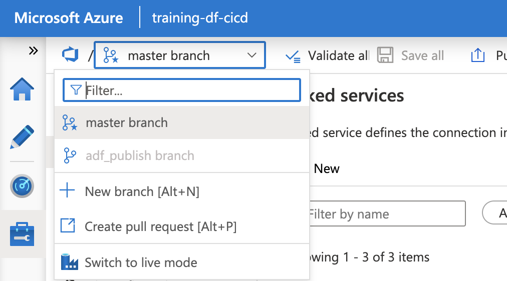
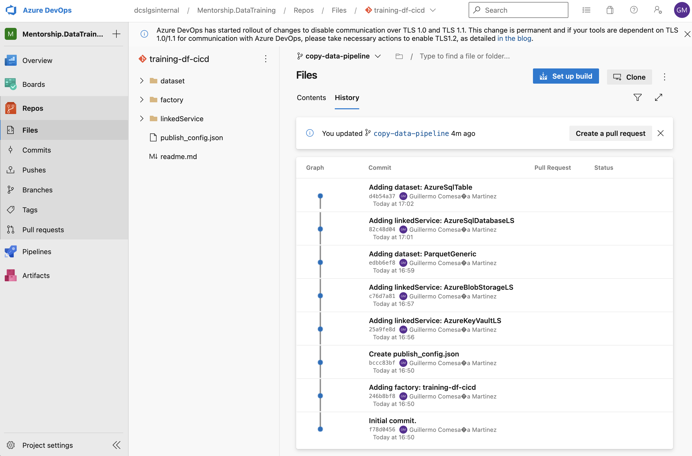
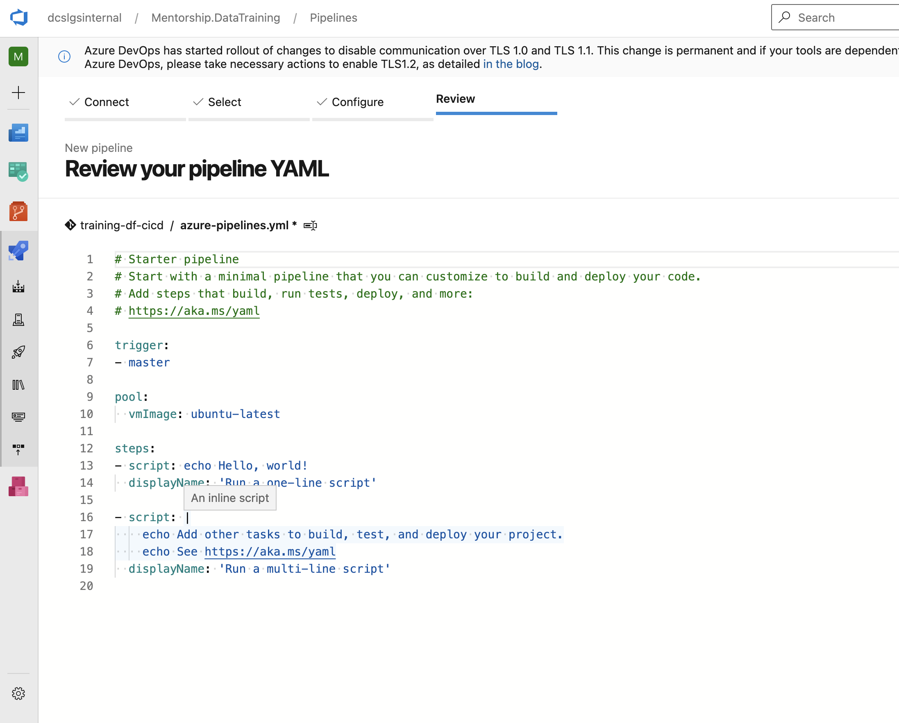
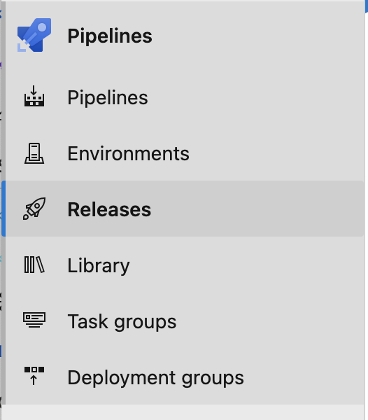
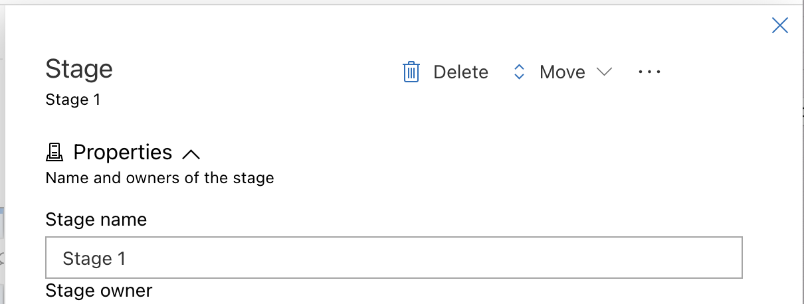
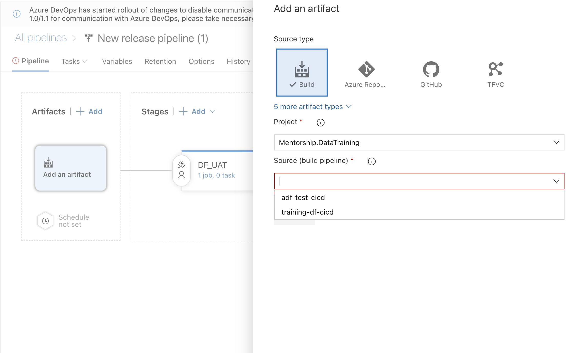
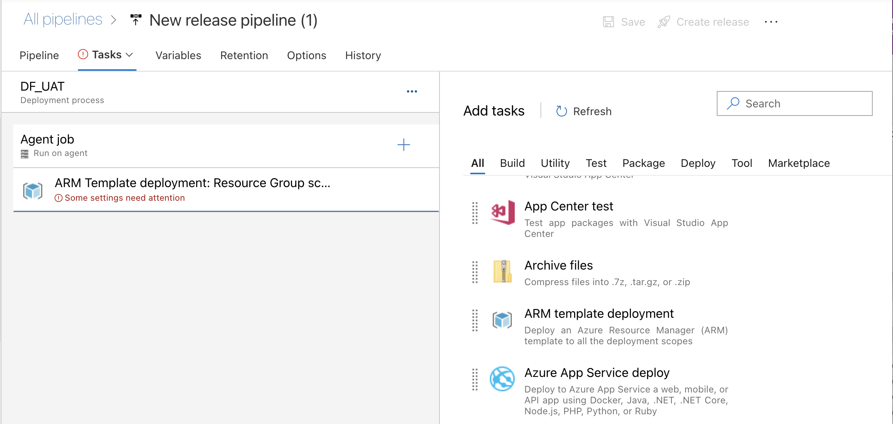

# adf-test-cicd

Simple ADF project aim to set up an ADF CI/CD pipelines in Azure DevOps

## Guide to set up repo + DevOps pipeline

> (Based on https://iterationinsights.com/article/azure-data-factory-ci-cd-with-devops-pipelines/, which is a bit outdated though and it doesn't include azure vault integration)

Aim is to provide a step-by-step guide to setup a DataFactory along with a repo to version changes and a CICD (Azure DevOps) to _move_ the changes (**deploy**) from _dev_ environment to _uat_ / _staging_ and then _production_.

Main difference with a application deployment is (it seems) we don't have local development here, as pretty much all the stuff is done using the Azure Portal (for the good and for the bad). If in an application full deployment we have a build stage (Azure DevOps Pipelines) and usually three release stages (Azure DevOps Releases, for _development_, _staging_/_uat_ and _production_), for a DataFactory will have a build stage (producing an ARM template) and just two release stages for _uat_ and _prod_.

### Create resources

First of all is to create resources in the Azure Portal or, much better, using some IaC tool. Terraform is preferred as it is widely used but if you are a Microsoft fan you can resort to [bicep](https://docs.microsoft.com/en-us/azure/azure-resource-manager/bicep/overview?tabs=bicep) to deploy resources to Azure.

We won't get deeper in the resource creation, just mention we should create three resource groups for development, uat and production, with **same resources** in all of them and using a nice naming convention (👉 [inspiration](https://docs.microsoft.com/en-us/azure/cloud-adoption-framework/ready/azure-best-practices/resource-naming)). Resources for a decent start data pipeline in every environment/resource group could be:
- a Data factory
- a Key vault
- a Storage account
- a (SQL) database

**Key vault** will hold the credentials which will be used to access to database and storage account from the datasets defined in the DataFactory. The _connection_ with the vault is done through _Linked services_ in the Data Factory. Follow [this Azure document](https://docs.microsoft.com/bs-latn-ba/azure/data-factory/store-credentials-in-key-vault) on how to set it up. 

> In order to successfully connect the Data Factory to a SQL Database instance through the Azure Vault and its linked service, the secret in the vault has to hold the **ADO.NET connection string**, not just the password, as some articles, tutorials hint to take that path. To do this one, go to the database resource - Properties then click on the _Show database connection string_ link 



Then copy the `ADO.NET` connection string. Edit that string replacing the `{your_password}` placeholder with the password set for the database and create a secret in the vault with the resulting string (and you can name it with something like `SQLDatabase<databasename>ConnectionString`).

### Set up repository for DataFactory and DevOps

Once in ADF _builder_, click on the top left **Set up code repository** button and follow the _wizard_ to connect the repo. 


Choose _Azure DevOps Git_ and _Active Directory_ then **Continue** at the bottom. Then follow the wizard to setup the actual repo properties. When you set the name in _Repository name_ you will see automatically new boxes to pre-filled. To follow the standard, leave them all as they are.

This repo is now a usual one, where the `master`/`main` branch will be the so-called _collaboration branch_ and you and/or team mates, can create _feature_ branches to develop and try features, which will be merged to `master` in the usual way via PRs. 

Click on **New** - _Pipeline_ to create a new data pipeline but I suggest to create a new branch (at the top left to work on prior to start adding assets.



 As you add/update _assets_ to your data factory, you will see folders and files will be created/updated via commits in the repo active branch every time you hit the **Save** button at the top left of the _canvas_ area, where you set the activities and dataflows. You can check this at any moment going to DevOps Repo, selecting the current working branch and click on **History** to see the commits. You barely can control these commit messages as they are automatically set by the platform.



So now the repo holding the code is already linked to the DevOps project, seeding the CICD pipeline

<!--
### DevOps Repository 

This stage will be the first one in the CICD process. For the ADF case, it will _compile_ the repo files to yield an ARM template with the assets in the DataFactory and the parameters used in any of those asets. But to set up the build we need to set up things which are common to all Azure DevOps pipelines.

You will need the company to set up a _Project_ in order to contain the repo for the DataFactory. Creating the _Project_ and related stuff (_organizations_, _subscriptions_, ...) are out of the scope of this paper, so I'll assume there is a project created. In the project view there are a left menu column with multiple entries. **Repos** and **Pipelines** are the interesting.

First we have to connect our repo with the CICD. Click in the `+` sign to add a new repo to the project. Select the repo type and set the name of the repo for Azure DevOps. A view with three options to set up the repo is shown (_Clone to your computer_ -to work on it-, _Push an existing work_ or _Import a repo_). As we already have the repo, any of the two last options are valid. I chose the latter, but then will mean you will have to work on the new repo leaving behind the previous one. Adding a new _remote_ or replacing the _remote_ for the working repo can be the best option. 
-->

### DevOps Build Pipeline

When the data pipeline we are working on is (entirely or partially) finished, we can do a PR to review then merge the work in the `master` branch. It's in this moment when the build and deployment to _uat_ then _production_ process starts.

> There are some pre-requisites before going straight to setup the CICD in Azure DevOps, like having a subscription, organization and DevOps project. The company should already have that in place, otherwise we have to find the right people to set up these prerequisites for us.

First we have to set up the build stage. For the ADF case, it will actually _compile_ the repo files to yield an _ARM template_ with the assets in the DataFactory and the parameters used in any of those assets. 

To set up the build, go to DevOps, _Pipelines_ and click on **New pipeline** button. Choose _Azure Repos Git_ and choose the repo holding your work and then _Starter pipeline_ and you will get a sample of a very simple, generic and mostly useless `azure-pipelines.yaml`, which you will have to customize. This file describes the build process for Azure pipelines. Now what is better is follow [this Microsoft doc](https://docs.microsoft.com/en-us/azure/data-factory/continuous-integration-delivery-improvements#the-new-cicd-flow) for the new and easy way to build the artifact out of the project. 

 As according to that document we have to add a file _external_ to the DataFactory we are working on, it is better:

- Merge the branch into master. Click on _Create a pull request_ and follow the usual flow to get the branch merged into `master`
- Create a new branch and add a `package.json` file with the following content as per the link above:
```js
{
    "scripts":{
        "build":"node node_modules/@microsoft/azure-data-factory-utilities/lib/index"
    },
    "dependencies":{
        "@microsoft/azure-data-factory-utilities":"^0.1.5"
    }
} 
```
- Commit, PR again and merge into `master`

Once we have the `package.json` file in our repo, paste the _yaml_ code found in the link above replacing the generic yaml Azure provides by default (follow the link to know how). Then click `Save` in the combo-button at the right top.



Now we are ready to run the pipeline and see if everything works ok. It will produce an _artifact_ which is actually an ARM template.

### DevOps Release Pipeline

These ones are the pipelines which actually will copy the assets of the DataFactory you developed to the _uat_, _production_ environments. Remember previously we had to create resource groups to support these environments.

To create a release pipeline first for _uat_, assuming all necessary resources are already in place in the related resource group, go to _Pipelines_ and click in **Releases** and click in **+ New**, **New release pipeline**. 



On _Select a template_ click on the small link at the top **Empty job**. On the Stage dialog name the stage to something like _UAT_, _Staging_ or similar then click on the three dots (···) and click on _Save template_ as that is the only option. 



#### Add artifact

Click on _Add and artifact_ panel fill the right value of the Build pipeline we just created before and click **Add** at the bottom. 



In the same panel, click on the bolt at the top right to set the _Continuous deployment trigger_ and enable the first check. The release will be automatically triggered every time a successful build is yielded.

#### Configure the UAT stage

First we will create some variables to configure the stage for _Location_, _ResourceGroup_, _DataFactory_, _VaultURI_. Names may change as you wish: 
- _Location_ has to be the **same** as the location of the Resource group and the Data Factory
- _ResourceGroup_ has to be the resource group where we are going to deploy the ADF, so the name of the UAT resource group we have
- _DataFactory_ has to be the name of the DataFactory resource in the resource group defined above
- _VaultURI_ has to be the URI of the vault in the environment (resource group) where the deployment is happening

Now, click on the _1 job, 0 tasks_ link inside the panel and, from the list, choose _ARM template deployment_. It shows a warning message (in red) so click on it to configure it. 



The main details to fill in are:

- Choose the right Service connection and Subscription (they should be the organization's ones, but I've used a different ones)
- set _Location_ to `$(Location)` to use the name of the `Location` variable just created.
- set _ResourceGroup_ the same way
- Template and Template parameters are got from the artifact generated in the build. So you can click on the three dots (···) and choose the ARM template and template parameters for the DataFactory.
- Override the _Template parameters_ for the name of the DataFactory and the URI of the vault by clicking again in the three dots (···) and adding:
  - `factoryName` - `$(DataFactory)`
  - `AzureKeyVaultLS_properties_typeProperties_baseUrl` - `$(VaultURI)`

Create a new release and check
- Every indicator is green -> 🎉
- Go to the resource group in the Azure Portal and check the DataFactory resource, before empty, now has the same assets than that one in the development resource group.

Try to debug/run the just deployed pipeline to see if everything is working.

Profit.

